# Browser Overlays for Streaming

This repository contains a variety of browser overlays that you can use with OBS, Streamlabs, or any other streaming software that supports browser sources. The overlays are designed to be easy to use, customize, and integrate into your stream.

## Features

- **Beautiful Overlays**: HTML/CSS overlays with elegant animations and minimal JavaScript.
- **Animated Elements**: Snowfall, aurora effects, and subtle animations for a dynamic look.
- **Easy to Customize**: Clear documentation on how to modify colors, text, and other elements.
- **Open Source**: Free to use and modify under the MIT License.

## Available Overlays

### Cozy 10:9 GameBoy

A charming GameBoy-inspired frame with leaf decorations, perfect for retro games.

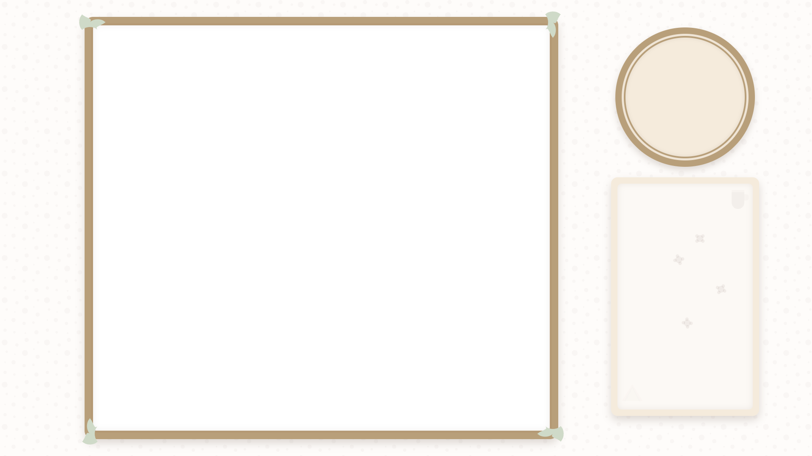

[📄 Documentation](sources/overlays/cozy%2010-9%20aspect%20ratio/overlay-readme.md) | 
[⬇️ Download ZIP](releases/cozy-10-9-aspect-ratio.zip?raw=true) | 
[🔍 Live Demo](https://detekoi.github.io/static-browser-overlays/sources/overlays/cozy%2010-9%20aspect%20ratio/overlay.html)

### Cozy 16:9 Widescreen

A modern 16:9 transparent overlay with minimalist borders, perfect for contemporary games and content.

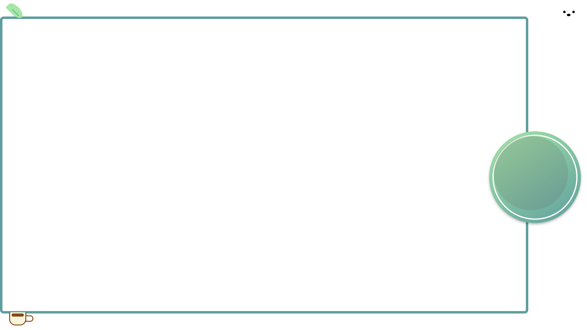

[📄 Documentation](sources/overlays/cozy%2016-9%20aspect%20ratio/overlay-readme.md) | 
[⬇️ Download ZIP](releases/cozy-16-9-aspect-ratio.zip?raw=true) | 
[🔍 Live Demo](https://detekoi.github.io/static-browser-overlays/sources/overlays/cozy%2016-9%20aspect%20ratio/overlay.htm)

### Cozy 4:3 Classic

A classic overlay designed for retro games and consoles that use the standard 4:3 aspect ratio. Features clean, transparent backgrounds with a vintage coffee cup decoration.

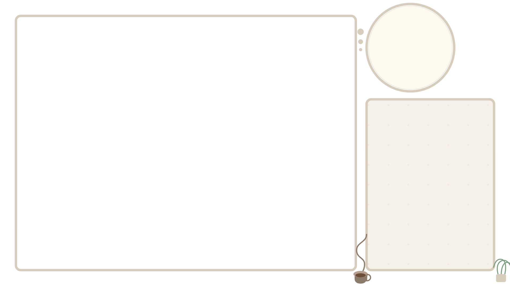

[📄 Documentation](sources/overlays/cozy-4-3-aspect-ratio/overlay-readme.md) | 
[⬇️ Download ZIP](releases/cozy-4-3-aspect-ratio.zip?raw=true) | 
[🔍 Live Demo](https://detekoi.github.io/static-browser-overlays/sources/overlays/cozy-4-3-aspect-ratio/overlay.html)

### Minimal 10:9

A clean, minimal overlay for 10:9 aspect ratio gameplay (common for Game Boy Advance and other handhelds) with **highly customizable** features - adjust border colors, thickness, radius, webcam position, size, and visibility using simple CSS variables.

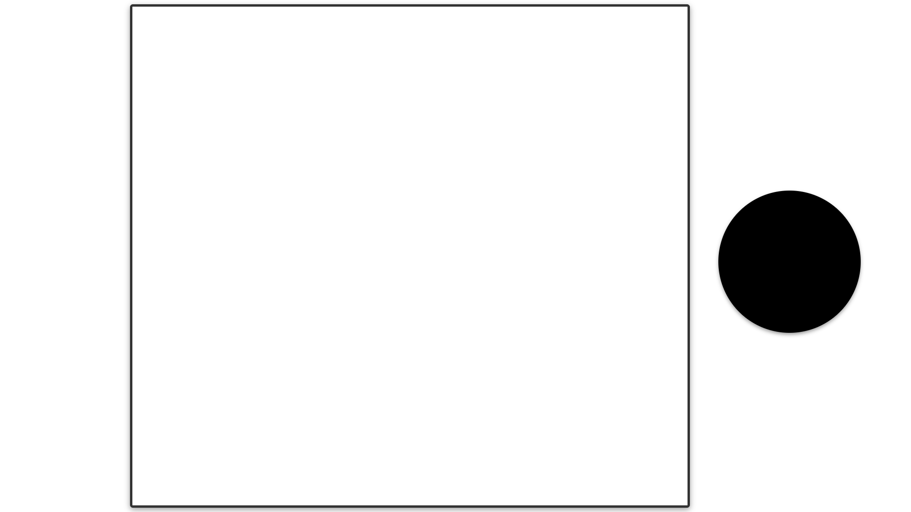

[📄 Documentation](sources/overlays/minimal-10-9/overlay-readme.md) | 
[⬇️ Download ZIP](releases/minimal-10-9.zip?raw=true) | 
[🔍 Live Demo](https://detekoi.github.io/static-browser-overlays/sources/overlays/minimal-10-9/overlay.html)

### Minimal 16:9

A clean, minimal overlay for 16:9 aspect ratio gameplay with **fully customizable** styling - easily change border colors, thickness, radius, webcam position, and background transparency to match your stream's theme using simple CSS variables.

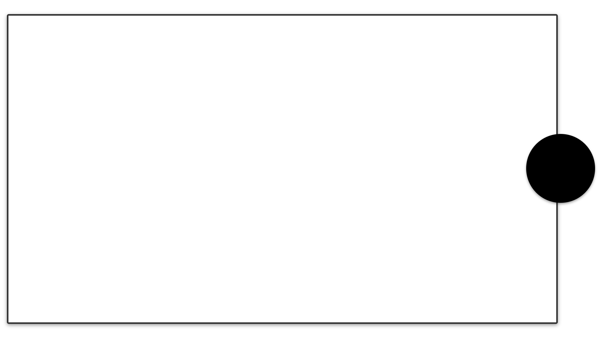

[📄 Documentation](sources/overlays/minimal-16-9/overlay-readme.md) | 
[⬇️ Download ZIP](releases/minimal-16-9.zip?raw=true) | 
[🔍 Live Demo](https://detekoi.github.io/static-browser-overlays/sources/overlays/minimal-16-9/overlay.html)

### Minimal 4:3

A clean, minimal overlay for 4:3 aspect ratio gameplay (classic consoles, arcade games, and retro PCs) with **extensive customization options** - modify border colors, thickness, corner roundness, webcam container styling, and layout positioning through easy-to-use CSS variables.

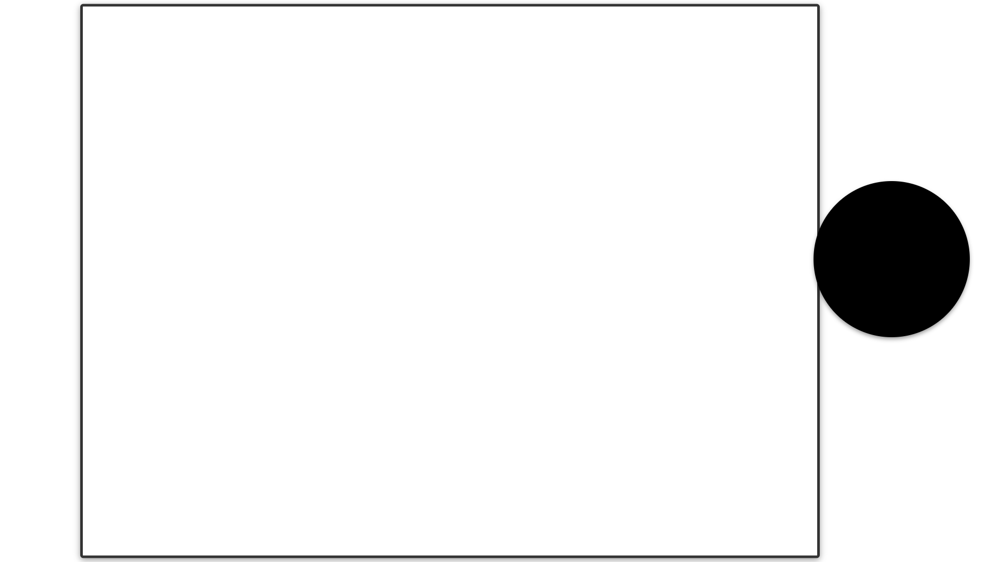

[📄 Documentation](sources/overlays/minimal-4-3/overlay-readme.md) | 
[⬇️ Download ZIP](releases/minimal-4-3.zip?raw=true) | 
[🔍 Live Demo](https://detekoi.github.io/static-browser-overlays/sources/overlays/minimal-4-3/overlay.html)

### Cozy 10:9 Aspect Ratio

A stylish overlay for Cozy 10:9 Aspect Ratio streams.

[📄 Documentation](sources/sources/overlays/cozy 10-9 aspect ratio/overlay-readme.md) | [⬇️ Download ZIP](releases/cozy-10-9-aspect-ratio.zip?raw=true)

### Cozy 16:9 Aspect Ratio

A stylish overlay for Cozy 16:9 Aspect Ratio streams.

[📄 Documentation](sources/sources/overlays/cozy 16-9 aspect ratio/overlay-readme.md) | [⬇️ Download ZIP](releases/cozy-16-9-aspect-ratio.zip?raw=true)

### Retro Sakura

A stylish overlay for Retro Sakura streams.

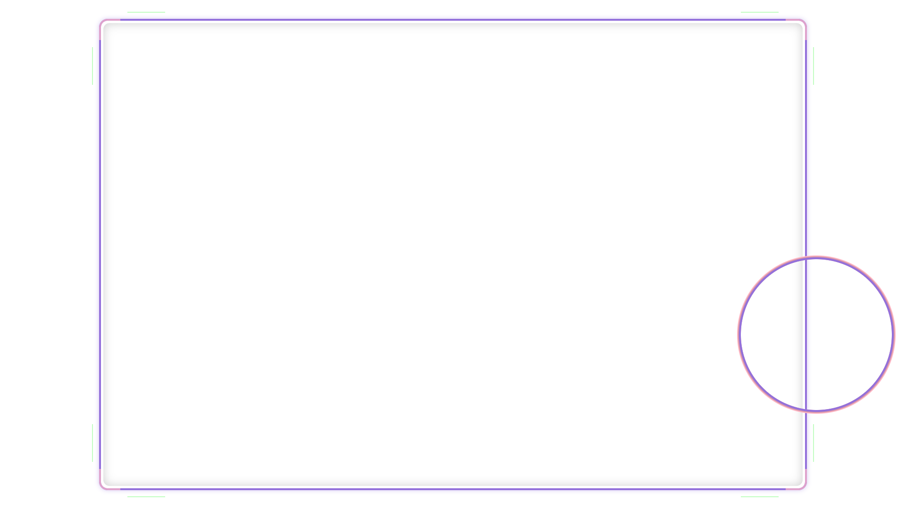

[📄 Documentation](sources/sources/overlays/retro-sakura/rero-sakura-readme.md) | [⬇️ Download ZIP](releases/retro-sakura.zip?raw=true)
## Available Backgrounds

### Sakura Background

A stylish overlay for Sakura Background streams.

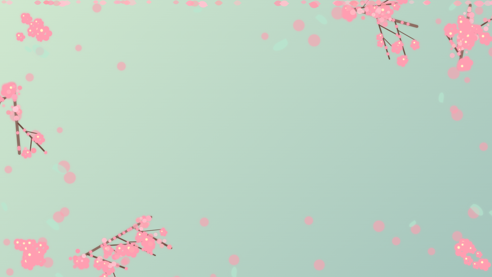

[⬇️ Download ZIP](releases/sakura-background.zip?raw=true)
### Cube Pattern Background

A stylish animated isometric cube pattern with dynamic lighting effects, perfect as a background for modern gaming streams.

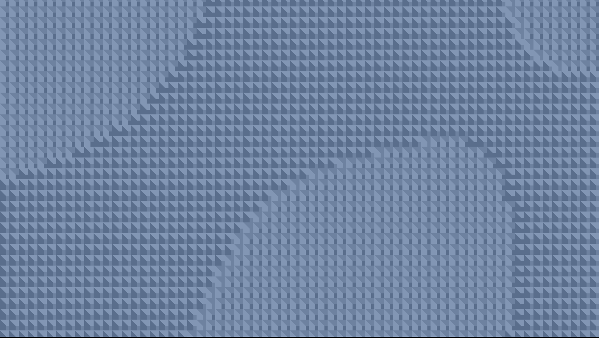

[📄 Documentation](sources/backgrounds/cube-pattern-background/cube-pattern-background-readme.md) | 
[⬇️ Download ZIP](releases/cube-pattern-background.zip?raw=true) | 
[🔍 Live Demo](https://detekoi.github.io/static-browser-overlays/sources/backgrounds/cube-pattern-background/cube-pattern-background.html)

### Arctic Background

A winter-themed background with animated aurora borealis effects, falling snowflakes, and a snowy landscape. Designed to be used as a background layer beneath other transparent overlays.

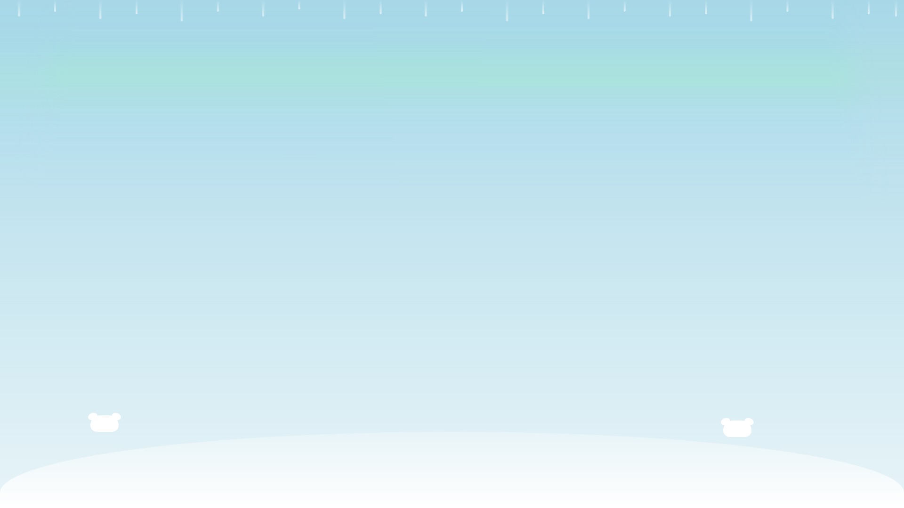

[📄 Documentation](sources/backgrounds/arctic-background/arctic-background-readme.md) | 
[⬇️ Download ZIP](releases/arctic-background.zip?raw=true) | 
[🔍 Live Demo](https://detekoi.github.io/static-browser-overlays/sources/backgrounds/arctic-background/arctic-background.html)

### Twinkling Stars Background

A beautiful animated background with twinkling stars of various sizes, colors, and brightness levels, perfect as a base layer for space-themed streams.

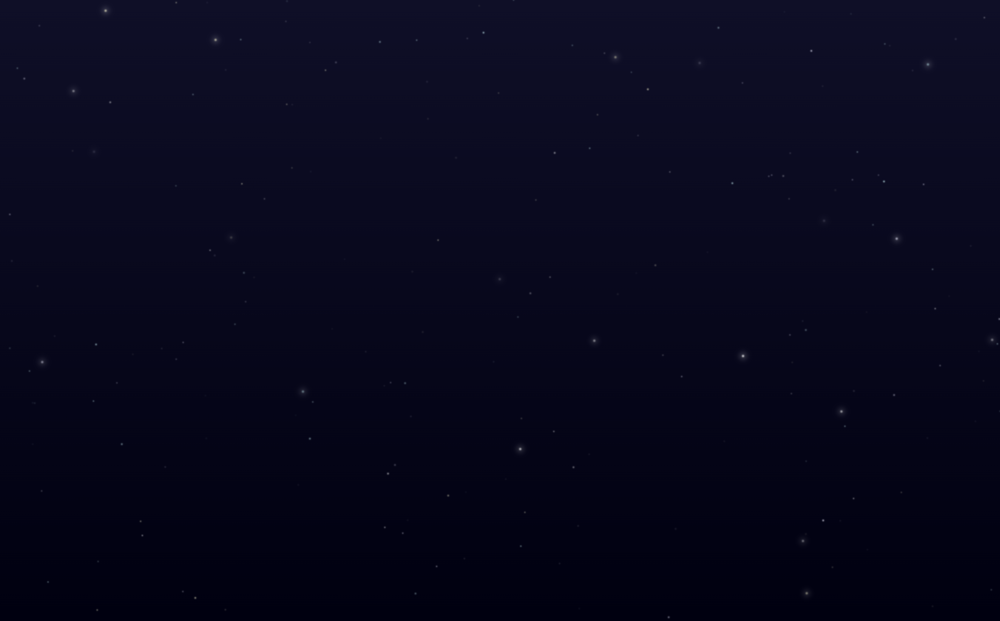

[📄 Documentation](sources/backgrounds/stars-background/stars-background-readme.md) | 
[⬇️ Download ZIP](releases/stars-background.zip?raw=true) | 
[🔍 Live Demo](https://detekoi.github.io/static-browser-overlays/sources/backgrounds/stars-background/stars-background.html)

## Getting Started

### Quick Start Options

**Option 1: Download and Use Locally (Recommended)**
- Download the ZIP file for your chosen overlay or background.
- Extract and use locally for full customization capabilities.
- Stable version that won't change unexpectedly.

**Option 2: Use Live Demo Links Directly**
- Copy the Live Demo URL and paste it into OBS as a browser source.
- No download required, but customization isn't possible.
- Requires internet connection while streaming.
- Subject to change if the repository is updated.

Check out the [installation guide](docs/installation.md) for complete instructions on both methods.

## Customization

See the [customization guide](docs/customization.md) for details on how to modify the overlays to match your stream's aesthetic. 
**Note**: Customization is only possible with locally downloaded files, not with the Live Demo links.

## Contributing

Contributions are welcome! See [CONTRIBUTING.md](CONTRIBUTING.md) for guidelines on how to contribute to this project.

## License

This project is licensed under the MIT License - see the [LICENSE](LICENSE) file for details.
