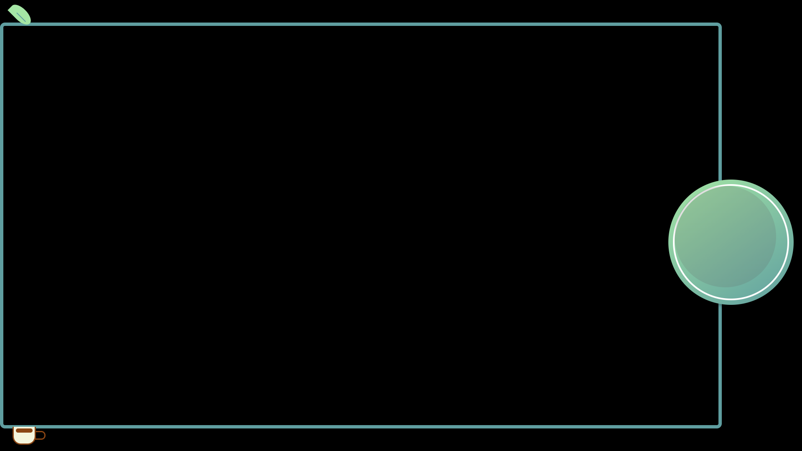
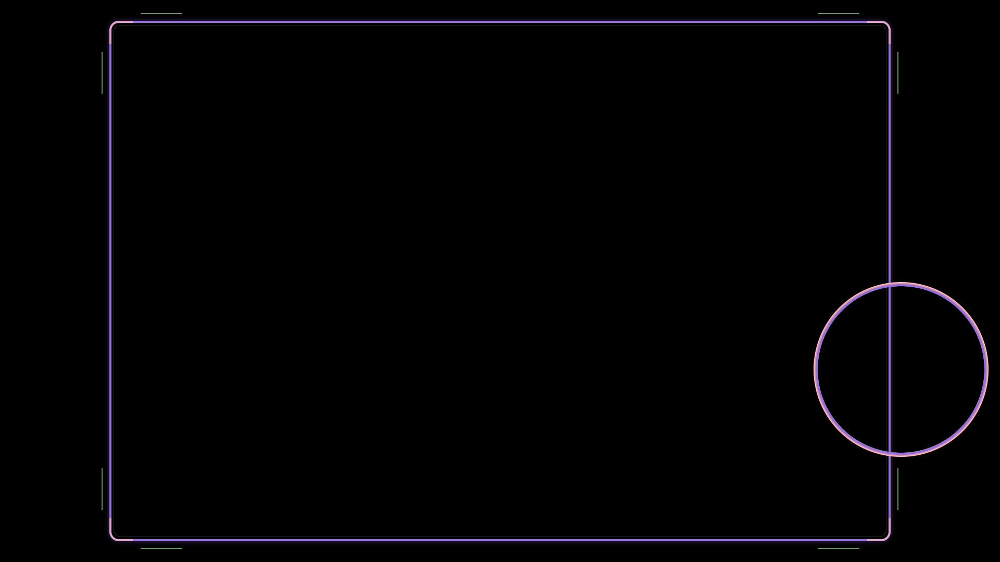
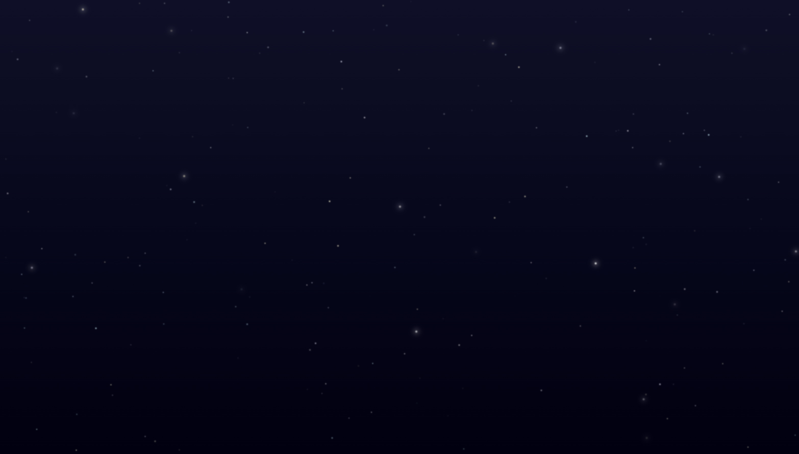

# Browser Overlays for Streaming

This repository contains a variety of browser overlays for OBS, Streamlabs, and other streaming software. The overlays are designed to be easy to use, customize, and integrate into your stream.

## Features

- **Beautiful Overlays**: HTML/CSS overlays with elegant animations and minimal JavaScript.
- **Animated Elements**: Snowfall, aurora effects, and subtle animations for a dynamic look.
- **Easy to Customize**: Clear documentation on how to modify colors, text, and other elements.
- **Open Source**: Free to use and modify under the MIT License.

## Available Overlays

### Cozy 10:9 Aspect Ratio

A stylish overlay for Cozy 10:9 Aspect Ratio streams.

[📄 Documentation](sources/overlays/cozy%2010-9%20aspect%20ratio/overlay-readme.md) | 
[⬇️ Download ZIP](releases/cozy-10-9-aspect-ratio.zip?raw=true) | 
[🔍 Live Demo](https://detekoi.github.io/static-browser-overlays/sources/overlays/cozy%2010-9%20aspect%20ratio/overlay.html)

### Cozy 16:9 Aspect Ratio

A stylish overlay for Cozy 16:9 Aspect Ratio streams.

[📄 Documentation](sources/overlays/cozy%2016-9%20aspect%20ratio/overlay-readme.md) | 
[⬇️ Download ZIP](releases/cozy-16-9-aspect-ratio.zip?raw=true) | 
[🔍 Live Demo](https://detekoi.github.io/static-browser-overlays/sources/overlays/cozy%2016-9%20aspect%20ratio/overlay.html)

### Retro Sakura

A stylish overlay for Retro Sakura streams, featuring springtime colors and a nostalgic aesthetic that brings a touch of elegance to your stream.

[📄 Documentation](sources/overlays/retro-sakura/retro-sakura-readme.md) | 
[⬇️ Download ZIP](releases/retro-sakura.zip?raw=true) | 
[🔍 Live Demo](https://detekoi.github.io/static-browser-overlays/sources/overlays/retro-sakura/retro-sakura.html)

### Minimal 10:9

A clean, minimal overlay for 10:9 aspect ratio gameplay with highly customizable features.

[📄 Documentation](sources/overlays/minimal-10-9/overlay-readme.md) | 
[⬇️ Download ZIP](releases/minimal-10-9.zip?raw=true) | 
[🔍 Live Demo](https://detekoi.github.io/static-browser-overlays/sources/overlays/minimal-10-9/overlay.html)

### Minimal 16:9

A clean, minimal overlay for 16:9 aspect ratio gameplay with fully customizable styling.

[📄 Documentation](sources/overlays/minimal-16-9/overlay-readme.md) | 
[⬇️ Download ZIP](releases/minimal-16-9.zip?raw=true) | 
[🔍 Live Demo](https://detekoi.github.io/static-browser-overlays/sources/overlays/minimal-16-9/overlay.html)

### Minimal 4:3

A clean, minimal overlay for 4:3 aspect ratio gameplay with extensive customization options.

[📄 Documentation](sources/overlays/minimal-4-3/overlay-readme.md) | 
[⬇️ Download ZIP](releases/minimal-4-3.zip?raw=true) | 
[🔍 Live Demo](https://detekoi.github.io/static-browser-overlays/sources/overlays/minimal-4-3/overlay.html)

## Available Backgrounds

### Sakura Background

A stylish background for Sakura-themed streams, adorned with delicate cherry blossoms and soft pastel colors, creating a serene and enchanting atmosphere.

[📄 Documentation](sources/backgrounds/sakura-background/sakura-background-readme.md) | 
[⬇️ Download ZIP](releases/sakura-background.zip?raw=true) | 
[🔍 Live Demo](https://detekoi.github.io/static-browser-overlays/sources/backgrounds/sakura-background/sakura-background.html)

### Cube Pattern Background

An animated isometric cube pattern with dynamic lighting effects, perfect as a background for modern gaming streams.

[📄 Documentation](sources/backgrounds/cube-pattern-background/cube-pattern-background-readme.md) | 
[⬇️ Download ZIP](releases/cube-pattern-background.zip?raw=true) | 
[🔍 Live Demo](https://detekoi.github.io/static-browser-overlays/sources/backgrounds/cube-pattern-background/cube-pattern-background.html)

### Arctic Background

A winter-themed background with animated aurora borealis effects, falling snowflakes, and a snowy landscape.

[📄 Documentation](sources/backgrounds/arctic-background/arctic-background-readme.md) | 
[⬇️ Download ZIP](releases/arctic-background.zip?raw=true) | 
[🔍 Live Demo](https://detekoi.github.io/static-browser-overlays/sources/backgrounds/arctic-background/arctic-background.html)

### Twinkling Stars Background

An animated background with twinkling stars, perfect as a base layer for space-themed streams.

[📄 Documentation](sources/backgrounds/stars-background/stars-background-readme.md) | 
[⬇️ Download ZIP](releases/stars-background.zip?raw=true) | 
[🔍 Live Demo](https://detekoi.github.io/static-browser-overlays/sources/backgrounds/stars-background/stars-background.html)

## Getting Started

### Quick Start Options

**Option 1: Download and Use Locally (Recommended)**
- Download the ZIP file for your chosen overlay or background.
- Extract and use locally for full customization capabilities.
- Stable version that won't change unexpectedly.

**Option 2: Use Live Demo Links Directly**
- Copy the Live Demo URL and paste it into OBS as a browser source.
- No download required, but customization isn't possible.
- Requires internet connection while streaming.
- Subject to change if the repository is updated.

Check out the [installation guide](docs/installation.md) for complete instructions on both methods.

## Customization

See the [customization guide](docs/customization.md) for details on how to modify the overlays to match your stream's aesthetic. 
**Note**: Customization is only possible with locally downloaded files, not with the Live Demo links.

## Contributing

Contributions are welcome! See [CONTRIBUTING.md](CONTRIBUTING.md) for guidelines on how to contribute to this project.

## License

This project is licensed under the MIT License - see the [LICENSE](LICENSE) file for details.
