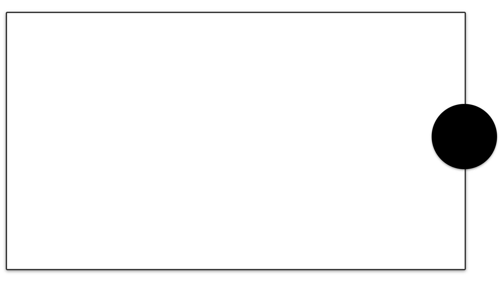

# Browser Overlays for Streaming

This repository contains a variety of browser overlays that you can use with OBS, Streamlabs, or any other streaming software that supports browser sources. The overlays are designed to be easy to use, customize, and integrate into your stream.

## Features

- **Beautiful Overlays**: HTML/CSS overlays with elegant animations and minimal JavaScript
- **Animated Elements**: Snowfall, aurora effects, and subtle animations for a dynamic look
- **Easy to Customize**: Clear documentation on how to modify colors, text, and other elements
- **Responsive Design**: Works across different stream sizes and resolutions
- **Open Source**: Free to use and modify under the MIT License

## Available Overlays

### Cozy 10:9 GameBoy

A charming GameBoy-inspired frame with leaf decorations, perfect for retro games.

[📄 Documentation](sources/overlays/cozy%2010-9%20aspect%20ratio/overlay-readme.md) | 
[⬇️ Download ZIP](releases/cozy-10-9-aspect-ratio.zip?raw=true) | 
[🔍 Live Demo](https://detekoi.github.io/static-browser-overlays/sources/overlays/cozy%2010-9%20aspect%20ratio/overlay.html)

### Cozy 16:9 Widescreen

A modern 16:9 transparent overlay with minimalist borders, perfect for contemporary games and content.

[📄 Documentation](sources/overlays/cozy%2016-9%20aspect%20ratio/overlay-readme.md) | 
[⬇️ Download ZIP](releases/cozy-16-9-aspect-ratio.zip?raw=true) | 
[🔍 Live Demo](https://detekoi.github.io/static-browser-overlays/sources/overlays/cozy%2016-9%20aspect%20ratio/overlay.htm)

### Cozy 4:3 Classic

A classic overlay designed for retro games and consoles that use the standard 4:3 aspect ratio. Features clean, transparent backgrounds with a vintage coffee cup decoration.

[📄 Documentation](sources/overlays/cozy-4-3-aspect-ratio/overlay-readme.md) | 
[⬇️ Download ZIP](releases/cozy-4-3-aspect-ratio.zip?raw=true) | 
[🔍 Live Demo](https://detekoi.github.io/static-browser-overlays/sources/overlays/cozy-4-3-aspect-ratio/overlay.html)

### Minimal 10:9

A clean, minimal overlay for 10:9 aspect ratio gameplay (common for Game Boy Advance and other handhelds) with black borders and customizable webcam positioning.

[📄 Documentation](sources/overlays/minimal-10-9/overlay-readme.md) | 
[⬇️ Download ZIP](releases/minimal-10-9.zip?raw=true) | 
[🔍 Live Demo](https://detekoi.github.io/static-browser-overlays/sources/overlays/minimal-10-9/overlay.html)

### Minimal 16:9

A clean, minimal overlay for 16:9 aspect ratio gameplay with black borders and fully customizable layout via CSS variables.

[📄 Documentation](sources/overlays/minimal-16-9/overlay-readme.md) | 
[⬇️ Download ZIP](releases/minimal-16-9.zip?raw=true) | 
[🔍 Live Demo](https://detekoi.github.io/static-browser-overlays/sources/overlays/minimal-16-9/overlay.html)

### Minimal 4:3

A clean, minimal overlay for 4:3 aspect ratio gameplay (classic consoles, arcade games, and retro PCs) with black borders and optimized dimensions.

[📄 Documentation](sources/overlays/minimal-4-3/overlay-readme.md) | 
[⬇️ Download ZIP](releases/minimal-4-3.zip?raw=true) | 
[🔍 Live Demo](https://detekoi.github.io/static-browser-overlays/sources/overlays/minimal-4-3/overlay.html)

## Available Backgrounds

### Arctic Background

A winter-themed background with animated aurora borealis effects, falling snowflakes, and a snowy landscape. Designed to be used as a background layer beneath other transparent overlays.

[📄 Documentation](sources/backgrounds/arctic-background/arctic-background-readme.md) | 
[⬇️ Download ZIP](releases/arctic-background.zip?raw=true) | 
[🔍 Live Demo](https://detekoi.github.io/static-browser-overlays/sources/backgrounds/arctic-background/arctic-background.html)

### Twinkling Stars Background

A beautiful animated background with twinkling stars of various sizes, colors, and brightness levels, perfect as a base layer for space-themed streams.

[📄 Documentation](sources/backgrounds/stars-background/stars-background-readme.md) | 
[⬇️ Download ZIP](releases/stars-background.zip?raw=true) | 
[🔍 Live Demo](https://detekoi.github.io/static-browser-overlays/sources/backgrounds/stars-background/stars-background.html)

## Getting Started

Check out the [installation guide](docs/installation.md) for instructions on how to add these overlays to your streaming setup.

## Customization

See the [customization guide](docs/customization.md) for details on how to modify the overlays to match your stream's aesthetic.

## Contributing

Contributions are welcome! See [CONTRIBUTING.md](CONTRIBUTING.md) for guidelines on how to contribute to this project.

## License

This project is licensed under the MIT License - see the [LICENSE](LICENSE) file for details.

## Community Guidelines

This project welcomes contributions from everyone and is committed to creating a friendly and inclusive environment. We encourage designs that are accessible to streamers from diverse backgrounds and that support LGBTQIA+ and anti-racist values.

For more information on our design approach and content standards, see the [CLAUDE.md](CLAUDE.md) file.

## Acknowledgements

- Thanks to all contributors and the streaming community