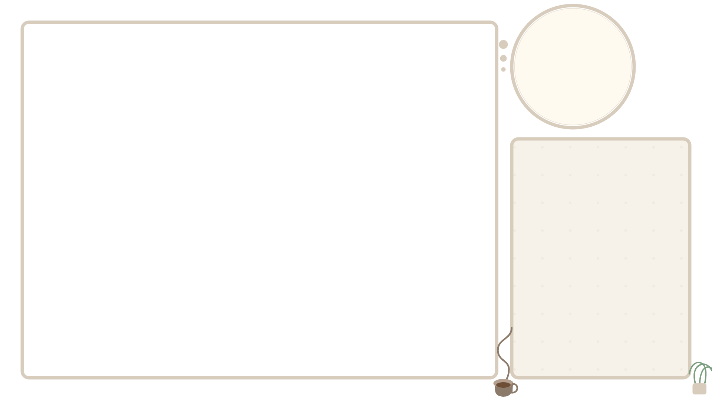

# Cozy 4:3 Classic Overlay - Documentation

This document explains how to use and customize the Cozy 4:3 Classic overlay for your retro gaming streams.

## Overview

A classic overlay designed for retro games and consoles that use the standard 4:3 aspect ratio. Features clean, transparent backgrounds with a vintage coffee cup decoration, perfect for streaming classic console games.



## Features

- Clean frame design optimized for 4:3 aspect ratio games.
- Vintage coffee cup and plant decorations for a cozy streaming atmosphere.
- Frame-only design for game, webcam, and chat areas, allowing content underneath to show through.
- Dedicated areas for game capture, webcam, and chat/information.
- SVG-based design for crisp visuals at any resolution.

## Adding to OBS Studio

This overlay now uses two separate HTML files for better layering control in OBS:
- `overlay-bg.html`: Contains the background pattern and decorative elements.
- `overlay.html`: Contains the main game frame, webcam frame, and chat area frame, along with SVG decorations.

Follow these steps for the recommended layering:

1.  **Add Background Source (`overlay-bg.html`)**:
    *   In OBS Studio, click the "+" button in the Sources panel.
    *   Select "Browser".
    *   Name it (e.g., "Overlay Background").
    *   Check "Local file" and browse to select `overlay-bg.html`.
    *   Set Width to 1920 and Height to 1080 (or your stream resolution).
    *   Click "OK". This should be your bottom-most layer.

2.  **Add Game Capture Source**:
    *   Add your game capture source (e.g., Window Capture, Game Capture).
    *   Place this source *above* the "Overlay Background" source in the list.
    *   Resize and position it roughly where the large rectangular frame area will be.

3.  **Add Webcam Source**:
    *   Add your webcam source.
    *   Place this source *above* the Game Capture source.
    *   Resize and position it roughly where the circular webcam frame area will be.

4.  **Add Chat Widget Source (Optional)**:
    *   If you use a browser-based chat widget (like from StreamElements, Streamlabs, etc.), add it as another Browser source.
    *   Place this source *above* the Webcam source.
    *   Resize and position it roughly where the rectangular chat frame area will be.

5.  **Add Main Overlay Source (`overlay.html`)**:
    *   Add another Browser source.
    *   Name it (e.g., "Game Overlay Frames").
    *   Check "Local file" and browse to select `overlay.html` (which includes `stream-overlay.svg`).
    *   Set Width to 1920 and Height to 1080.
    *   Click "OK". This source should be placed *at the top* of all the sources mentioned above (Background, Game, Webcam, Chat).

6.  **Fine-tune Positioning**:
    *   Select your Game Capture source and adjust its size and position precisely so it fits neatly within the main rectangular frame provided by the "Game Overlay Frames" source.
    *   Select your Webcam source and adjust its size and position to fit within the circular frame.
    *   Select your Chat Widget source and adjust its size and position to fit within the chat box frame.

*The final layer order in OBS should look like this (bottom to top):*
1.  `Overlay Background` (overlay-bg.html)
2.  `Game Capture`
3.  `Webcam`
4.  `Chat Widget` (if used)
5.  `Game Overlay Frames` (overlay.html / stream-overlay.svg)

## Customization Options

### Modifying the SVG Elements

The main visual components (frames, decorations) are in `stream-overlay.svg`. The background is in `overlay-bg.html`.

1. Open `stream-overlay.svg` in a text editor or SVG editor.
2. Edit the elements as needed:
   - Frame colors can be changed by modifying `stroke` attributes.
   - Frame thickness by `stroke-width`.
   - Element positions can be adjusted by changing coordinate values (x, y, cx, cy).
   - Shapes can be modified by editing path data or rect/circle attributes.

### Changing Decorations (Coffee Cup, Plant)

These are defined as `<path>` elements within `stream-overlay.svg`.

1. Find the relevant SVG path groups in `stream-overlay.svg`.
2. Modify colors by changing the `fill` and `stroke` values.
3. You can replace them with different icons by changing the path data.
4. Adjust their position by modifying the coordinate values within the path data or applying a `transform` attribute.

### Color Scheme

The main frame colors are defined by `stroke` attributes in `stream-overlay.svg`:

```xml
stroke="#D8CCBD" <!-- Main frame border color -->
stroke="#E8DFD2" <!-- Webcam inner border color -->
```

The decorative element colors (`fill` and `stroke`) can also be changed in the SVG.
The background color and pattern are set in the `body` style of `overlay-bg.html`.

### Layout Adjustments

The layout is defined in `stream-overlay.svg`'s `viewBox` and element positions/sizes.

1. Modify the SVG `viewBox` attribute (currently `0 0 1280 720`) if you need to change the base coordinate system.
2. Adjust `rect` elements' `x`, `y`, `width`, and `height` attributes to resize frames.
3. Adjust `circle` elements' `cx`, `cy`, and `r` attributes.
4. Update path data or apply `transform` attributes to reposition decorative elements.

## Special Configuration for Different Systems

### For NES/SNES Games:
- The default layout works perfectly for Nintendo 8-bit and 16-bit consoles.
- No adjustments needed for standard NES/SNES emulators.

### For PlayStation 1:
- Many PS1 games use 4:3 aspect ratio and work well with this overlay.
- Some PS1 games use a slightly different resolution that may need minor tweaking.

### For Classic PC Games:
- Works well with DOS games and early Windows games that use 4:3 resolution.
- May need minor adjustments for games that use unusual aspect ratios.

## Advanced Customization

For more extensive customization:

1. **Adding Text Elements**: Insert custom SVG text elements for stream info.
2. **Custom Decorations**: Replace or add SVG decorative elements that match your brand.
3. **Animation**: Add CSS animations to bring elements to life (subtle movements of the coffee cup, steam effects, etc.).

## Compatibility

This overlay is designed for:
- Classic console games (NES, SNES, Genesis, etc.).
- Retro PC games.
- Arcade emulators.
- Any content that uses the standard 4:3 aspect ratio.

## Troubleshooting

If elements don't align properly:
1. Verify your OBS canvas is set to 1920x1080 (or your streaming resolution).
2. Ensure the browser sources (`overlay-bg.html`, `overlay.html`) Width and Height match your canvas.
3. Check that your game, webcam, and chat sources are properly sized and positioned *underneath* the `Game Overlay Frames` source.
4. Ensure the layer order in OBS matches the structure described above.
5. Try refreshing the browser sources in OBS.

## Questions or Issues?

If you have any questions about customizing this overlay or encounter any issues, please open an issue in the GitHub repository.
